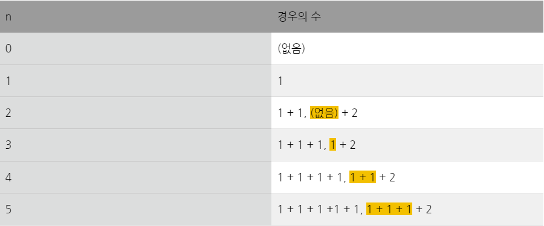

# BOJ_G5_15989_1,2,3더하기4

[문제링크](https://www.acmicpc.net/problem/15989)

### 분류
다이나믹 프로그래밍


### 접근법
1. 숫자 1로 n을 만들 수 있는 경우의 수는 한가지 이므로 1차원 dp테이블을 1로 채운다. 인덱싱을 편하게 하기위해 n+1개의 요소를 만든다.
2. 1, 2의 합으로 정수 n을 나타내는 방법은 (n - 2)를 1의 합만으로 나타낸 방법에 2를 더해주면 된다.

3. 3 또한 마찬가지의 방법으로 진행한다.

### Code
```python
T = int(input())

for _ in range(T):
    n = int(input())
    # 1차원 dp테이블 생성
    dp = [1] * (n + 1)
    
    for i in range(2, n+1):
        dp[i] += dp[i - 2]
 
    for i in range(3, n+1):
        dp[i] += dp[i - 3]

    print(dp[n])


# 느낀점:
# 풀이는 1차원 리스트로 풀었지만
# 2차원 리스트로 dp문제를 이해하면 더 쉽게 느껴지는 것 같다.
```